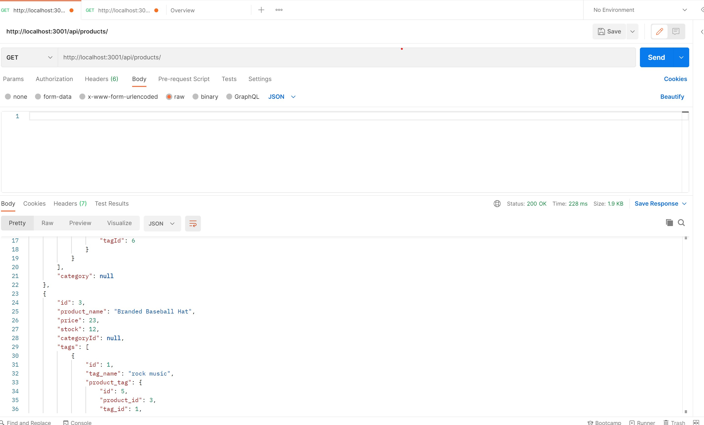
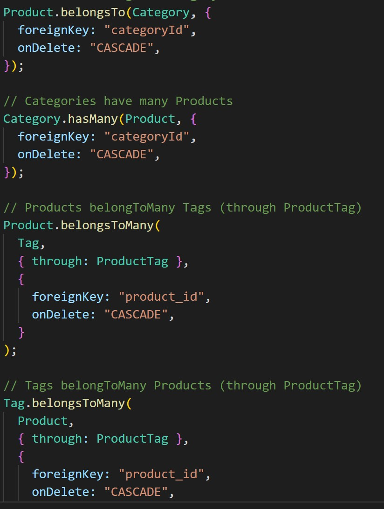

# E-commerce BackEnd

## Description

This project utilises object realtional mapping to generate a database and use information from each object to be displayed appropriately. The use of models allows organisation of the database and api routes are used as parameters to what can be displayed, added, removed or edited. This application uses sequelize, express, and mysql2 to seed the database

## Table Of Contents

- [Installation](##Installation)
- [Usage](##Usage)
- [License](##License)
- [Contributing](##Contributing)
- [Tests](##Tests)
- [Questions](##Questions)

## Installation

Models are created to store data and api routes are used to access information. Using an API client such as Postman or Insomnia, access to http requests are available along the route paths

## Usage

The above image shows an example of what can be seen using Postman
The image below shows the links between each model

[link to example video](https://drive.google.com/file/d/1V5PT_dW-eKXm5xUeZFXKAahoy3R3GRhT/view?usp=sharing)

## License

This project is covered under the MIT License

## Contributing

[bencyna](https://github.com/bencyna/)

## Tests

Run the application using `node server.js` in the root directory and naviagte to localhost:3001/ the api routes, use get, post, put or destory requests on postman or insomnia to interact

## Questions

If you have any questions about this project, you can veiw my github account at https://github.com/bencyna or email me at benjamincyna@gmail.com
